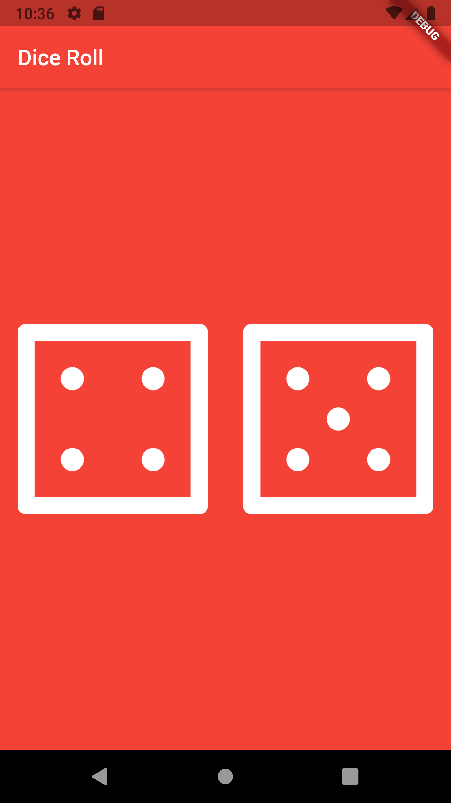

# This is a single screen app having two dice.

# How this app works ?

There are a total of 6 dice in the project. So, Let's say when you tap on a die (for example die-1) it'll change it's value ranging from 1 to 6.

## Take aways from the project

* Importance of set state in flutter
* Generating random numbers with in a range in dart using math library
* Importance of Expanded Widget
* Importance of padding and margins

## A quick look at the project

# Learning source 

[udemy](https://www.udemy.com/course/flutter-bootcamp-with-dart/)

<a href = "https://stackoverflow.com">Stack Overflow</a>
